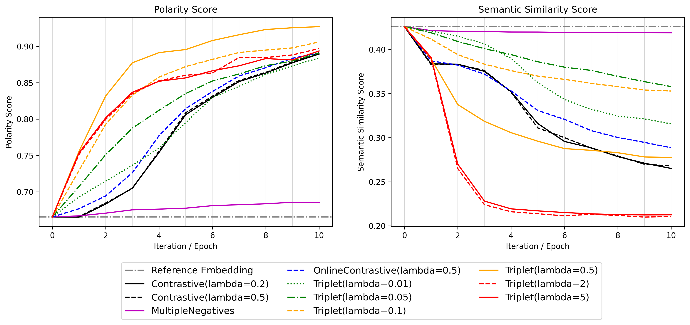

# sarcasm-retrieval

This code repository is part of the report "Sarcasm Retrieval in fine-tuned Sentence Embeddings" for the course TDT4310.

## Running the project

To run the project follow the following steps:

- Run all cells of `data/prepare_dataset.ipynb` to generate the dataset that we used in our experiments
- Run all cells of `train_and_eval_models.ipynb`
  - select which models to exclude from training by putting them as comments
- Run all cells of `visualize_model_records.ipynb`

## Results

For more details, read the [paper](assets/paper.pdf).
